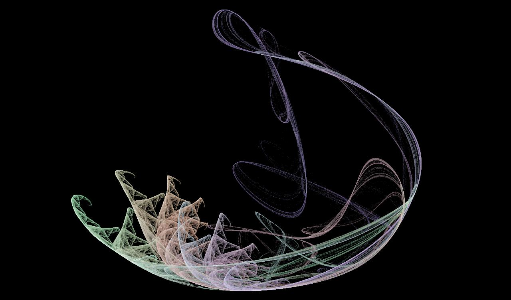

# FlameFrame

## About
FlameFrame is used to view and save images based on potentially complex systems of fractal functions. FlameFrame is a Java/Swing implementation of the generalized algorithm taken from [this paper](http://flam3.com/flame.pdf).

## Usage
The viewer renders fractals to the screen in real time. You can drag, rotate, and zoom the graph to position things as you like. Note that re-positioning the viewer automatically clears the screen. In order to more easily visualize the graph, points can be rendered in bold and/or white. When the user has positioned the image how they would like, press "Draw Now" to fill out the image by rendering a large number of points at once (try doing this multiple times or adjusting the number of iterations to get different results). When the resulting image is satisfactory, you can save it to file.

## Settings
You can change the blend values for different functions (known as "variations") to change the appearance of the image. You can also shift the color spectrum used. You must press "Apply Settings" before your changes can take effect.

## Example

